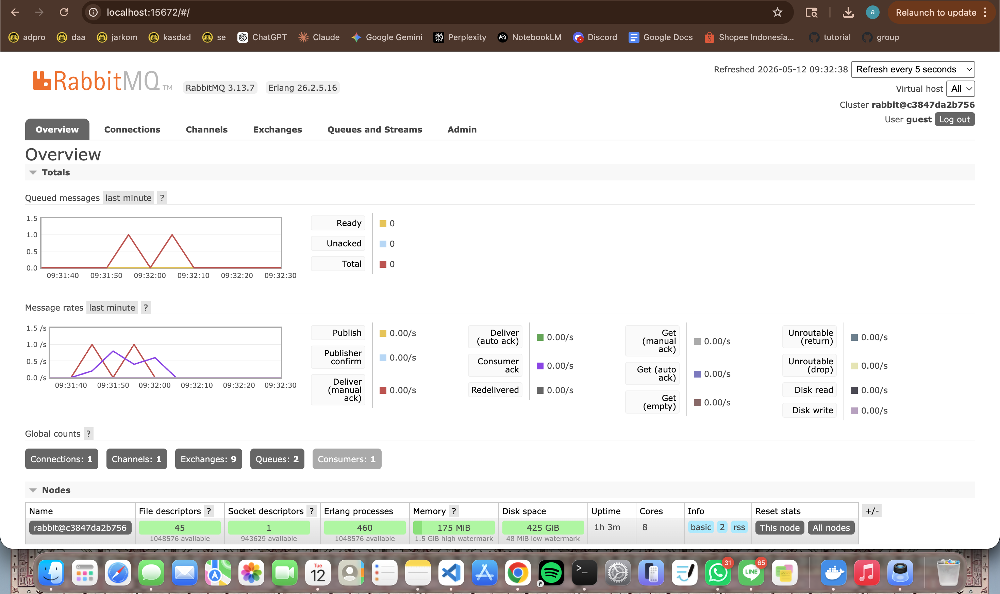

a. What is amqp?
AMQP (Advanced Message Queuing Protocol) is a communication protocol used for sending messages between applications through a message broker. Instead of applications communicating directly with each other, they send messages to the broker first, and the broker will distribute the messages to the correct receiver. This approach helps applications communicate more efficiently and asynchronously.

b. What does it mean? guest:guest@localhost:5672 , what is the first guest, and what is the second guest, and what is localhost:5672 is for?
The text guest:guest@localhost:5672 is part of the connection URL used to connect to the message broker.
- The first guest is the username.
- The second guest is the password.
- localhost means the broker is running on the same computer.
- 5672 is the default port commonly used by RabbitMQ for AMQP communication.
In this tutorial, the subscriber connects to RabbitMQ using this configuration to listen for incoming messages from the queue.

The screenshot above shows the RabbitMQ monitoring dashboard after running the publisher multiple times. The spikes on the chart indicate that the publisher was continuously sending event messages to the message broker. Those messages were then placed into queues before being processed by the subscriber. The total number of queues shown in RabbitMQ is 2 because RabbitMQ automatically created the main queue used for handling the user_created events and another related queue for message handling purposes. Since the subscriber processes messages one by one, the queue helps store incoming events temporarily so that no messages are lost while waiting to be consumed.
